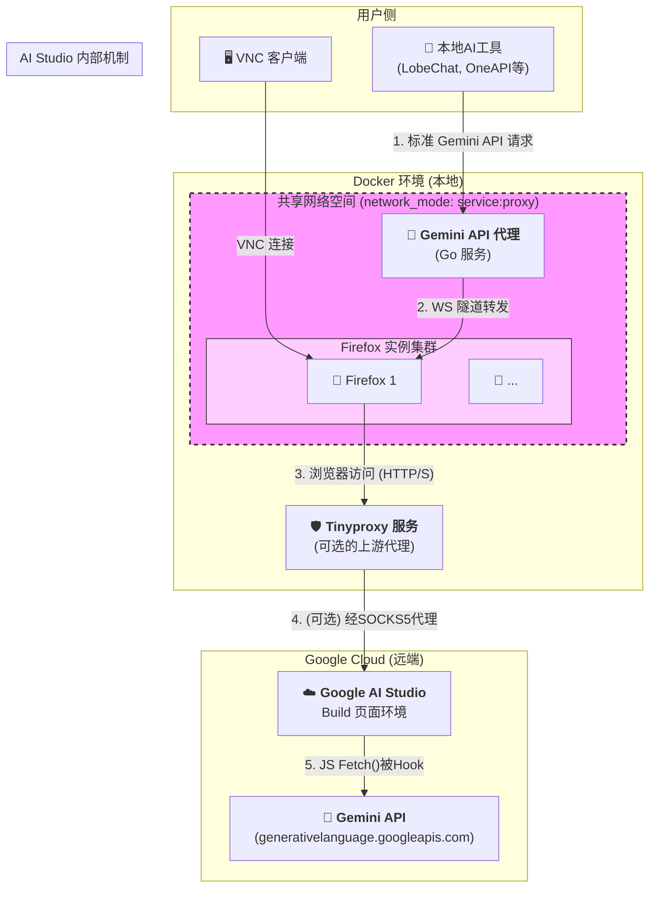

# 🚀 项目：自动化、可扩展的容器化浏览器集群

本项目为您提供一个功能强大、高度可定制的远程浏览器解决方案，旨在通过 Docker 容器化技术，实现对多个 Firefox 实例的自动化管理和扩展。它内置了强大的网络代理功能，特别适用于需要利用浏览器环境执行自动化任务、进行网页抓取或作为复杂 API 请求（如 Google Gemini）中继的场景。

---

## ✨ 核心特性

- **⚙️ 配置驱动**: 仅需修改 `.env` 文件，即可轻松控制整个系统的关键参数，无需深入代码。
- **📈 一键扩展**: 通过修改 `INSTANCES` 变量，可秒级创建或销毁任意数量的、相互隔离的 Firefox 实例。
- **🛡️ 自动代理转换**: 内置 `tinyproxy` 服务，可将需要认证的外部 SOCKS5 代理无缝转换为内部统一的、无需认证的 HTTP 代理，极大简化客户端配置。
- **💾 数据持久化**: 每个浏览器实例的用户数据（登录会话、书签、Cookies 等）都通过独立的 Docker 命名卷进行持久化，重启或升级后数据不丢失。
- **🔗 协议兼容**: 通过巧妙的共享网络设计，从根本上解决了安全页面 (`https`) 访问非安全 WebSocket (`ws://`) 的混合内容（Mixed Content）问题。
- **🔬 启动健康检查**: 利用 Docker 的 `healthcheck` 机制，确保所有服务按照预设的依赖关系健康、有序地启动，保证系统稳定性。
- **🚇 隧道代理**: 内置一个 HTTP-over-WebSocket 隧道代理，允许外部工具通过标准 HTTP 请求，利用浏览器环境执行需要复杂认证或特定环境的 API 调用。

---

## 🏗️ 系统架构

系统由三个核心服务和一套动态配置脚本组成，所有服务都在 Docker 环境中运行，并通过共享网络空间实现高效通信。

### 架构图



### 交互流程

1.  **动态生成**: `generate_compose.py` 脚本读取 `.env` 配置，动态生成包含指定数量 Firefox 实例的 `docker-compose.yml` 文件。
2.  **启动与连接**: `docker-compose up` 启动所有服务。用户通过 VNC 客户端连接到 `localhost` 的相应端口（如 `5901`）来访问 Firefox 实例。
3.  **流量代理 (可选)**: Firefox 实例被预配置为使用 `tinyproxy` 作为 HTTP 代理。`tinyproxy` 接收到请求后，会通过配置好的外部 SOCKS5 代理将流量转发出去。
4.  **HTTP-over-WebSocket 隧道**:
    - Firefox 中运行的 Web 应用（客户端）与 `Gemini API 代理` 服务建立一个持久的 WebSocket 连接。
    - 外部工具（如本地脚本）向 `Gemini API 代理` 发送一个标准 HTTP 请求。
    - 代理服务将此 HTTP 请求封装成消息，通过 WebSocket 隧道发送给浏览器中的客户端。
    - 浏览器客户端执行请求，并将响应通过 WebSocket 隧道回传给代理服务，最终返回给外部工具。
5.  **共享网络**: 所有 Firefox 实例和 `Gemini API 代理` 服务共享同一个网络命名空间，因此它们可以通过 `localhost` 互相访问，这对于 WebSocket 连接至关重要。

---

## 🛠️ 组件详解

### 1. Gemini API 代理 (`proxy` 服务)

- **技术栈**: Go 语言, `gorilla/websocket`。
- **构建**: 使用多阶段 Dockerfile (`proxy.Dockerfile`) 构建，确保最终镜像是最小化的 Alpine Linux。
- **核心原理**: 这是一个 **HTTP-over-WebSocket 隧道代理**。它允许将外部的 HTTP 请求“隧道化”到浏览器环境中执行。这对于需要利用浏览器登录态、Cookies 或执行复杂 JavaScript 计算的 API 调用场景非常有用。它通过一个全局连接池管理所有来自浏览器的 WebSocket 连接，并支持轮询负载均衡。

### 2. 上游代理转换器 (`tinyproxy` 服务)

- **技术栈**: `tinyproxy` on Alpine Linux。
- **核心原理**: 作为一个轻量级的 HTTP 代理，其主要作用是“转换”代理协议。它接收来自 Firefox 的标准 HTTP 代理请求，然后根据环境变量的配置，将这些请求通过一个需要认证的 SOCKS5 代理转发出去。`entrypoint.sh` 脚本在容器启动时动态生成配置文件，实现了配置的灵活性。

### 3. Firefox 实例 (`firefox-*` 服务)

- **技术栈**: 基于带有 VNC 服务器的 Firefox Docker 镜像。
- **核心原理**: 每个实例都是一个完整的、隔离的浏览器环境。通过环境变量，可以在启动时动态配置其 VNC 端口、启动 URL 以及网络代理设置（直接写入 Firefox 的 `prefs.js`）。每个实例的数据都保存在独立的 Docker 卷中，实现了状态的持久化。

---

## 📁 项目结构

```
.
├── aistudio-build-proxy/         # Git子模块: Gemini API 代理的Go源码
│   ├── main.go
│   └── go.mod
├── monitoring/                   # (可选) 监控套件配置
│   ├── prometheus/
│   │   └── prometheus.yml
├── tinyproxy/                    # Tinyproxy服务目录
│   ├── Dockerfile
│   ├── entrypoint.sh
│   └── tinyproxy.conf.template
├── .env.example                  # 环境变量示例文件
├── .gitmodules                   # Git子模块配置文件
├── proxy.Dockerfile              # Gemini API 代理的Dockerfile
├── docker-compose.base.yml       # 基础服务(proxy)的Compose模板
├── firefox.service.template.yml  # Firefox实例的Compose模板
├── generate_compose.py           # 动态生成docker-compose.yml的脚本
├── requirements.txt              # Python脚本依赖
└── README.md                     # 本文档
```

---

## 🚀 快速开始

### a. 环境设置 (首次)

1.  **克隆仓库并初始化子模块**:

    ```bash
    git clone https://github.com/CberYellowstone/aistudio-build-proxy-docker.git
    cd aistudio-build-proxy-docker

    git submodule update --init aistudio-build-proxy
    ```

2.  **安装 Python 依赖**:
    ```bash
    pip install -r requirements.txt
    ```
3.  **创建配置文件**:
    ```bash
    cp .env.example .env
    ```

### b. 配置与启动

1.  **编辑 `.env` 文件**: 打开 `.env` 文件，根据下方 **配置说明** 修改参数。确保根据需要设置 `WITH_MONITORING` 的值为 `true` 或 `false`。
2.  **生成 `docker-compose.yml`**:
    ```bash
    python generate_compose.py
    ```
3.  **启动服务**:
    ```bash
    docker-compose up -d --build
    ```
    此命令会根据您的 `.env` 配置，启动核心服务或包含监控套件的完整服务。

### c. 连接与使用

- **连接到 Firefox (VNC)**:
  - 第一个实例: `localhost:5901`
  - 第二个实例: `localhost:5902`
  - ...以此类推
  - **VNC 密码**: `password` (可在 `.env` 文件中修改)
- **使用 Gemini 代理 (从外部工具)**:
  - 向 `http://localhost:5345` 发送您的 HTTP 请求。
- **访问监控数据 (如果 `WITH_MONITORING=true`)**:
  - 打开浏览器并访问 Prometheus UI: `http://localhost:9090`
  - 您可以在此执行 PromQL 查询，直接分析和调试所有采集到的指标。

### d. 停止服务

- 要停止并移除所有容器、网络和卷（**将清除所有浏览器数据**），请运行：
  ```bash
  docker-compose down -v
  ```
- 如果只想停止容器但保留数据，请运行：
  ```bash
  docker-compose down
  ```

---

## ⚙️ 配置说明 (`.env` 文件)

| 变量                    | 类型      | 描述                                                                               | 默认值                            |
| ----------------------- | --------- | ---------------------------------------------------------------------------------- | --------------------------------- |
| `INSTANCES`             | `Integer` | 要创建的 Firefox 实例的数量。                                                      | `1`                               |
| `STARTUP_URL`           | `String`  | 每个 Firefox 实例启动时默认加载的 URL。                                            | `https://aistudio.google.com/...` |
| `WITH_MONITORING`       | `Boolean` | 是否部署 Prometheus 监控服务。                                                     | `false`                           |
| `USE_TINYPROXY`         | `Boolean` | 是否启用 `tinyproxy` 服务。设置为 `true` 时，Firefox 将通过 `tinyproxy` 转发流量。 | `false`                           |
| `UPSTREAM_SOCKS_SERVER` | `String`  | **(仅当 `USE_TINYPROXY` 为 `true` 时有效)** 外部 SOCKS5 代理服务器的地址。         | (空)                              |
| `UPSTREAM_SOCKS_PORT`   | `Integer` | **(仅当 `USE_TINYPROXY` 为 `true` 时有效)** 外部 SOCKS5 代理服务器的端口。         | (空)                              |
| `UPSTREAM_SOCKS_USER`   | `String`  | **(可选)** 外部 SOCKS5 代理的用户名。                                              | (空)                              |
| `UPSTREAM_SOCKS_PASS`   | `String`  | **(可选)** 外部 SOCKS5 代理的密码。                                                | (空)                              |
